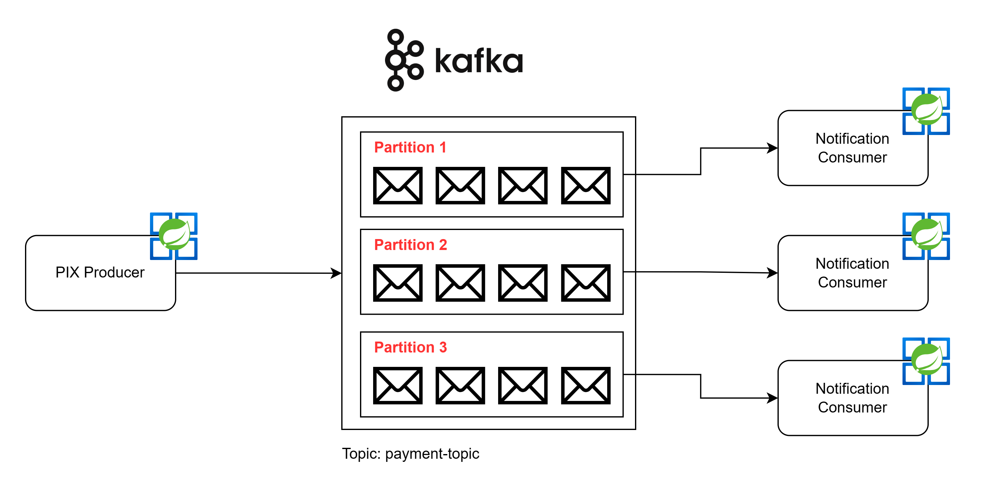

# Payment System - Kafka Integration

This is a payment system that utilizes Kafka technology for asynchronous integration among its different components.



## Technologies

- Java 21
- Spring Boot
- Kafka
- Docker

## Applications

### [pix-processor](./pix-processor)

This application is responsible for processing PIX payment transactions. It integrates with Kafka to send messages
related to transactions.

### [notification](./notification)

The notification application is responsible for sending notifications to users regarding payment transactions. It
integrates with Kafka to consume messages related to transactions and send notifications accordingly.

## Getting Started

Create Kafka infrastructure using docker:

``` shell
docker-compose up -d --build
```

---
Developed by [Jean Jacques Barros](https://github.com/jjeanjacques10)